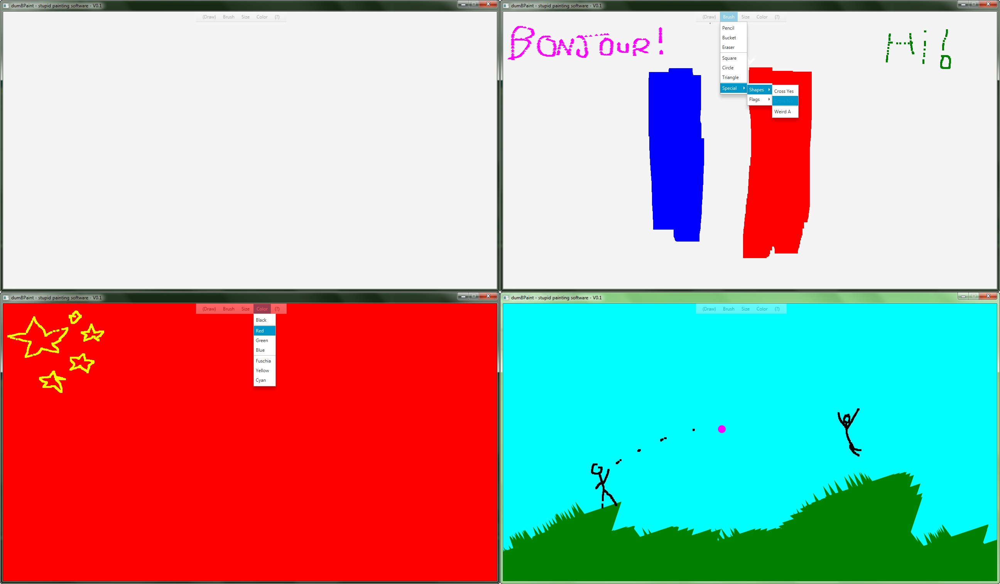

# dumBPaint (V 0.1)
## About
dumBPaint is a simple yet usefull drawing software who keep it simple !
Only w/ basics shapes, sizes and colors it is time to show your idea to the world !

## ScreenShots

## What's in this version (V 0.1)?
* (Draw) : New
* Brush : Pencil, Bucket, Eraser, Square, Circle, Triangle, Special Shapes
* Size : Small, Medium, Large, XL, XXL, XXXL
* color : Black, Red, Green, Blue, Fuchsia, Yellow, Cyan

## Future Plan
* Save Function
* Load Function
* ? Menu (the menu with Help and About)
* DocString in code
* More Shapes
* More Colors

## Credits
2019 - EDDY IKHLEF